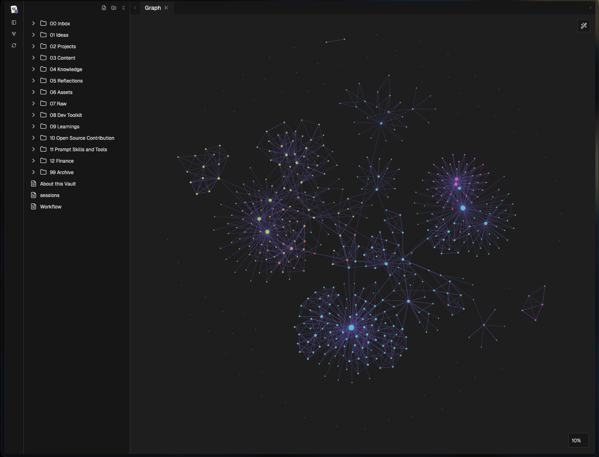

# Wiki-Web

A browser-based home for an Obsidian-style Markdown vault. Keep your notes as files on your own machine, browse and edit them in the web UI, search across them, and explore `[[wikilinks]]` in the graph.

I've been using this with my own vault for the past couple of months. It started as something I needed for myself, and I thought I'd share it with you guys.



## What it does

- Browse folders and Markdown notes, with preview and source editing.
- Search note names, folders, and note contents.
- Open `[[wikilinks]]` and see linked notes in an interactive graph.
- Create notes and folders; edit existing notes in place.
- Work with frontmatter, checklists, tabs, and split views.

## Run locally

Requires Node.js and npm. Tested with Node.js 22.

1. Clone [this repo](https://github.com/utpalsinghdev/wiki-web):

   ```bash
   git clone git@github.com:utpalsinghdev/wiki-web.git
   ```

   Use `https://github.com/utpalsinghdev/wiki-web.git` instead if you don't have an SSH key configured for GitHub.

2. Connect your vault. Put your existing Obsidian vault (the folder containing your `.md` notes) next to `wiki-web/` and name it `Vault`, or create a symlink at that location:

   ```text
   workspace/
   ├── Vault/                 # your notes, outside the repo
   │   └── My note.md
   └── wiki-web/
       └── package.json
   ```

   Example for an existing vault elsewhere on your computer (run from inside `wiki-web/`):

   ```bash
   ln -s "/absolute/path/to/your/vault" ../Vault
   ```

   If `../Vault` already exists, don't overwrite it; move or rename that directory first, or change `vaultRoot` in `vite-plugin-vault.ts` to point to your vault. The vault is **not copied into this repo or uploaded to GitHub**. The server accesses the files directly and writes edits back to them, so back up your vault before trying it with notes you care about. Only Markdown files appear in the explorer; `.obsidian`, `.git`, and `node_modules` directories are skipped.

3. From `wiki-web/`, install dependencies and start the server:

   ```bash
   npm ci
   npm run dev
   ```

4. Open `http://localhost:4000`. Your notes should appear in the sidebar. There is no vault-path setting in the UI yet.

## Self-hosting and security

This is a Vite development server with a local file-backed API, not a packaged production server. `npm run build` only creates frontend assets; it does not create a standalone backend for vault access. To keep the API working, run `npm run dev` on the host with the vault mounted at `../Vault`.

**Do not expose the server directly to the public internet.** It currently binds to `0.0.0.0`, has no authentication, accepts arbitrary hostnames, and provides read/write access to your Markdown vault. Use a private network or an access-controlled proxy if you need remote access. Do not treat the included `ecosystem.config.cjs` as a portable deployment recipe: it points to a machine-specific Node installation.

## Status

Personal project, shared as-is. Not a drop-in replacement for every Obsidian feature or plugin. Current build/typecheck has outstanding errors outside the README; check and resolve those before treating this as a production-ready deployment.

## License

MIT. See [LICENSE](LICENSE).
